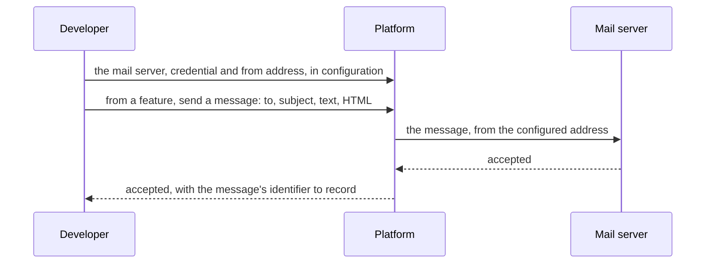
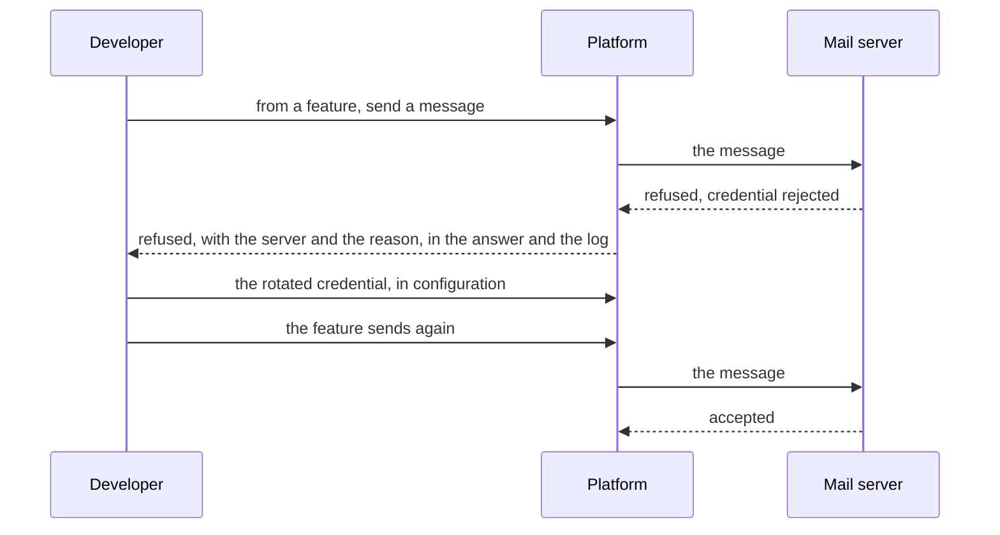
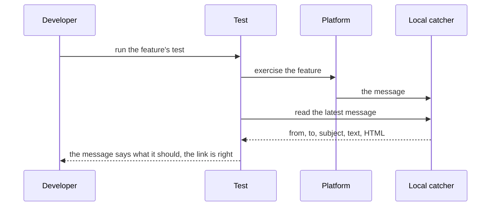

# Mail

## Objective

A developer building a platform on these components can send email to
a person: an invitation to join something, a notice that something
changed, a message somebody operating the platform asked for. Today no
component sends email, so a platform that needs to shows the person
who asked a link to pass on by hand.

This PRD says what sending email means for a platform built here: what
a message carries, where it goes and how that is configured, what the
platform learns of the outcome, how it is kept secure, and how it is
tested without a message leaving the machine. Every platform built on
these components gets the same capability, and each installation of
one chooses the mail server it sends through.

## Users and stakeholders

**Developer.** Builds a platform on these components. Wants to send a
message from a feature in one call, without learning a mail library;
to name the mail server, its credential and the from address in
configuration and nowhere else; to learn of every refusal and lose no
message silently; and to prove in a test that a feature sent what it
should, without a mailbox. The people a platform's mail reaches, and
whoever operates an installation of it, are the developer's users, and
this PRD sees them through the developer.

## Goals

- **A message in one call.** A from address with a display name, the
  to, cc and bcc recipients, a reply-to, a subject, a plain-text body
  and an optional HTML alternative, and any extra header the feature
  needs.
- **Through the mail server the configuration names.** Host, port, how
  the connection is secured, the account and its credential, the from
  address: configuration, never code. The same platform sends through
  a Google Workspace domain today and through any other mail server
  tomorrow.
- **Secure by default.** Encrypted on the wire. The credential comes
  from the environment or the secret store, never a file in the
  repository. Cleartext is a choice the developer makes explicitly, for
  a local run, and never a default.
- **An outcome, never silence.** The mail server accepted the message,
  and here is its identifier. Or it refused, and here is why and which
  addresses it refused.
- **Plainly from the sender.** The message comes from the address and
  display name the configuration sets, and replies go where the feature
  says.
- **Tested without sending.** A local catcher stands in for the mail
  server in development and tests. A test sends through the platform's
  own path and reads the message back. Nothing leaves the machine.
- **Observable.** Every handover is logged with the message's
  identifier, the outcome and the recipient's domain, never the body
  and never the address, and carries a trace span.

## Non-goals

- **Receiving mail.** The platform sends. A reply, a bounce or a
  complaint lands in the sending mailbox, and reading that mailbox is
  outside the platform.
- **Composing content.** What a message says, and any template it is
  built from, belongs to the feature that sends it.
- **Queueing, retry and scheduling.** A refused send is reported to the
  feature that asked, which decides whether to try again, on the same
  terms as its other outbound work. The platform holds no queue of
  mail.
- **Deliverability tooling.** Bounce and complaint handling, suppression
  lists, open and click tracking and reputation dashboards are the
  provider's. The platform learns whether the mail server accepted the
  message, and nothing after.
- **Bulk or marketing mail.** One recipient, one occasion. A campaign
  is a different product.
- **Attachments.** Text and HTML only. See Open questions.
- **A provider's own HTTP interface.** The platform speaks the standard
  mail submission protocol, which every provider offers. See Delivery
  options.
- **The identity provider's own mail.** Verification and password-reset
  messages are the identity provider's to send, from its own
  configuration.

## Functional scope

### Delivery options

Four ways of getting a message from the platform to a person were
considered. The first is chosen.

- **Submission to a configured mail server.** The platform hands each
  message to a mail server over the standard submission protocol, with
  an account and a credential the developer configures. Every provider
  offers this, a corporate mail server offers it, and so does a local
  catcher, so one capability covers development, test and every
  installation. Changing provider is a change of configuration. A
  message sent through the domain's own provider already carries that
  domain's sender authentication, so no DNS change is needed.
- **A provider's HTTP interface.** Sending through one provider's own
  interface, with a service account. Not chosen: it ties the platform
  to one provider, leaves a service-account key to guard, has no local
  catcher, and the message still has to be built.
- **A transactional email provider.** A dedicated provider with the
  installation's domain authenticated there. Gives bounce and complaint
  feedback, suppression lists and dashboards, at the price of a second
  vendor, a cost and DNS changes. Not chosen now. Through such a
  provider's submission endpoint it is the chosen option with a
  different mail server, so the door stays open.
- **One mail interface with pluggable senders.** The chosen option
  first, a provider's interface later, chosen in configuration. Not
  chosen: it designs the seam before a second sender exists.

### Sending a message

A feature builds a message and asks the platform to send it. The
message carries:

- **From.** An address and a display name. Where the feature gives
  none, the configured from address.
- **Recipients.** To, cc and bcc, each one or more addresses.
- **Reply-to.** Where a reply should go, when the from address is not
  read.
- **Subject.**
- **Body.** Plain text, and optionally an HTML alternative. A mail
  client that renders HTML shows that, and every other shows the text.
- **Headers.** Any extra header the feature needs.

The call returns one of two things. Accepted: the mail server took the
message, and the identifier the platform gave it. Refused: the reason,
and where the server refused some recipients and took others, which
were which. An address that is not a valid address is refused before
anything is sent.

The platform gives every message its identifier before sending, so the
feature that asked can record it beside whatever the message was about.

### Where mail goes

The configuration names one mail server per installation: its host and
port, how the connection is secured, the account and its credential,
and the address and display name mail comes from. The platform reads
that at start and holds nothing else about the provider.

The connection is secured one of three ways: upgraded to an encrypted
connection after connecting, on the submission port, which is the
default; encrypted from the first byte, on the port providers reserve
for that; or not at all, for a local catcher.

### An installation on Google Workspace

An installation whose domain is hosted on Google Workspace has three
ways to send from an application, and the platform works with all
three.

- **The Gmail mail server, with an app password.** The account's own
  address, an app password the account's owner creates once two-step
  verification is on, and an encrypted connection. Mail comes from that
  account's address and no other. Up to 2,000 messages a day.
- **The mail service for applications.** Enabled by the Workspace
  administrator for the organisation, and authenticated by the address
  the platform connects from, by an account's credential, or both. Mail
  may come from any address in the domain. Up to 10,000 recipients per
  user a day.
- **The restricted mail server.** Port 25, authenticated by the
  connecting address only, and only to recipients in the domain.

The recommendation is the service for applications, authenticated with
a no-reply account's credential and with the connecting address where
the installation has a fixed one, over an encrypted connection. Mail
sent this way carries the domain's own sender authentication, so a
recipient's mail client trusts it as it trusts any mail from the
domain.

### Security

- The connection to the mail server is encrypted outside a local run,
  and the server's certificate is checked against its name.
- The credential arrives from the environment or the secret store. It
  is never a file in the repository and never in a log.
- Cleartext, and sending without a credential, are for a local catcher
  and have to be configured explicitly.

### Testing

A local mail catcher runs beside the tests, as the database and the
message broker do. A test sends through the platform's own path,
against the catcher, and reads the message back: from, to, subject,
text and HTML. Nothing leaves the machine. The same catcher serves a
developer's local run, so a feature can be tried by hand with the
catcher's own inbox open in a browser.

### Observability

Every send is logged once, with the message's identifier, the outcome,
and the recipient's domain. The body, the subject and the address are
never logged. A send carries a trace span, so it appears in the trace
of whatever asked for it. A refusal is an error the developer can act
on: the log says which mail server refused, and why.

### Limits

A provider's limits, whether messages or recipients per day or
recipients per message, are the developer's to know and stay within.
The platform's mail is one recipient per occasion, and its volume
follows the number of people who use the platform, not the number of
customers those people serve.

## User journeys

### 1. A feature sends its first message

The developer configures the mail server once and calls send from the
feature. The platform hands the message over and answers with the
identifier, which the feature records beside whatever the message was
about.

### 2. The mail server refuses

A credential was rotated at the provider and not in the configuration.
The send answers a refusal with the reason, the log carries the same,
and the developer corrects the configuration. The feature tries again
on its own terms and the message goes out.

### 3. A developer proves a feature sends

The test sends through the same path production does, against a
catcher that keeps the message for the test to read. No mailbox, no
provider, nothing leaves the machine.

## Open questions

- **Attachments.** A statement as a PDF is the obvious first need.
  Nothing is designed.
- **Replies to a no-reply address.** Whether every message names a
  reply-to that is read, or a no-reply address is left to bounce.
- **Sign-in to the mail server without a password.** Providers offer
  a token in place of a password for an application. Whether an
  installation should use one, and how the platform obtains it.
- **Who reads the bounces.** A delivery that fails after the mail
  server accepted the message arrives as a bounce in the sending
  mailbox. Whether the developer's team reads that mailbox, and
  whether the platform should one day.
- **Connection reuse.** The platform connects once per message. Whether
  the volume of any installation asks for more.
- **A record of every send.** Whether a platform keeps its own record
  of what was sent, beside the feature that sent it, so the question of
  what went to whom is answered from the platform rather than the
  provider.
- **A tenant sending as itself.** Every message comes from the
  configured address. A tenant of a platform sending from its own
  domain needs that domain authenticated at the mail server, and is
  not designed.
- **A second provider.** An installation on a provider other than
  Google Workspace is configuration on the platform's side and DNS on
  the developer's, and nobody has done it.

## References

- [smtp](../tdd/smtp.md) — SMTP, the design that serves this PRD.
- [Send email from a printer, scanner, or app](https://knowledge.workspace.google.com/admin/gmail/send-email-from-a-printer-scanner-or-app)
  — Google's page on the three ways an application sends through a
  Google Workspace domain.
- [RFC 5321](https://www.rfc-editor.org/rfc/rfc5321) — Simple Mail
  Transfer Protocol.
- [RFC 5322](https://www.rfc-editor.org/rfc/rfc5322) — Internet Message
  Format.
- [RFC 6409](https://www.rfc-editor.org/rfc/rfc6409) — Message
  Submission for Mail.
- [RFC 3207](https://www.rfc-editor.org/rfc/rfc3207) — SMTP Service
  Extension for Secure SMTP over Transport Layer Security.
- [RFC 4954](https://www.rfc-editor.org/rfc/rfc4954) — SMTP Service
  Extension for Authentication.
- [RFC 8314](https://www.rfc-editor.org/rfc/rfc8314) — Cleartext
  Considered Obsolete: Use of TLS for Email Submission and Access.
