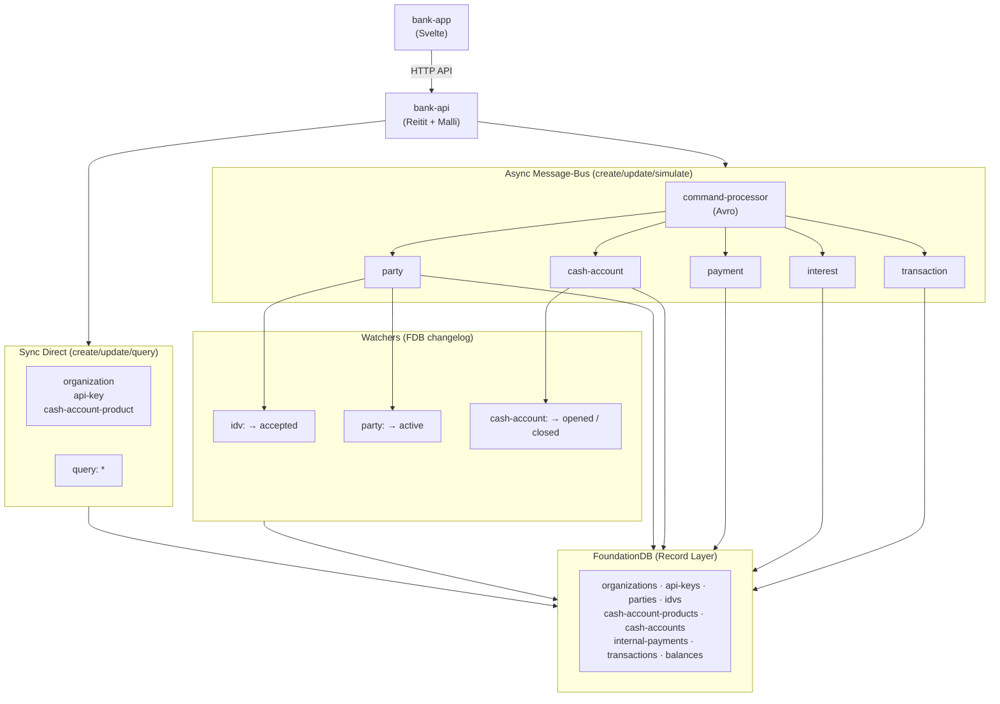

# mono

A Clojure monorepo for building production-ready distributed systems,
following the [Polylith](https://polylith.gitbook.io/polylith) software architecture.

## What It Is

`mono` is a component library and reference implementation for composing
production systems from well-defined, independently testable building blocks.
Systems are described as data — YAML/EDN configuration files drive lifecycle,
dependency injection, and environment management, with no global state and no
framework magic.

## How to Use It

Fork this repo and strip the banking exemplar to start building your own
domain:

```bash
# 1. Fork and clone the repo
gh repo fork kjothen/mono --clone
cd mono

# 2. Remove the bank exemplar and scaffold your domain
just fork <your-domain>
```

This deletes all `bank-*` components, bases, and projects, rewires
`deps.edn`, `workspace.edn`, CI workflows, and the Justfile to your new
domain name, and leaves empty alias scaffolds ready for your own code.

From there:

1. Add domain components under `components/<your-domain>-*/`
2. Add domain bases under `bases/<your-domain>-*/`
3. Add domain projects under `projects/<your-domain>-*/`
4. Register your new bricks in the `:+<your-domain>` alias in `deps.edn`

See [Getting Started](#getting-started) for prerequisites and how to run
tests.

## Exemplar: Queenswood Bank

The repo ships an end-to-end banking application — **Queenswood** — that
onboards customers and manages accounts. It demonstrates how the component
library composes into a production-shaped system.

### API Docs

Full API documentation is published at
[https://kjothen.github.io/mono/](https://kjothen.github.io/mono/).
Interactive OpenAPI documentation is also served locally at
[http://localhost:8080](http://localhost:8080) when the server is running.

### Customer Onboarding Flow

1. **Create an organisation** — an admin creates a tenant and receives an API
   key (prefixed `sk_live_`, returned once, stored hashed).
2. **Configure products** — draft a cash account product with balance products
   then publish a version to make it available for account opening.
3. **Create a party** — register a customer with personal details and a
   national identifier (uniqueness enforced).
4. **Identity verification** — an IDV record is automatically created and
   accepted, triggering the party's transition from `pending` to `active`.
5. **Open an account** — only active parties may open accounts against a
   published product. Each account is assigned a UK SCAN payment address
   (sort code + sequential account number). Opening an account automatically
   creates balances from the product's balance products.
6. **Account lifecycle** — accounts move through `opening` → `opened` →
   `closing` → `closed`, driven by API calls and reactive watchers.
7. **Fund an account** — simulate an inbound transfer to credit a customer
   organisation's settlement account. This records a double-entry internal
   transfer — debiting the internal org's suspense balance and crediting the
   customer's default balance — via the transactions command processor.
8. **Internal Payments** - reward customers from the organization's
   settlement account, and internally transfer money between accounts
   of a customer.
9. **Accrue / Capitalize Interest** — simulate daily interest accrual
   and monthly capitalisation for a customer organisation. Accrual
   calculates interest on each account's default balance using the
   product's rate (in basis points), posting legs that debit the
   settlement account's interest-payable and credit the customer's
   interest-accrued. Capitalisation moves accrued interest into the
   customer's default balance and clears the corresponding payable
   on the settlement account. Fractional interest below one minor
   unit is carried forward in a micro-unit accumulator on the
   balance record.

### Demo

[](https://github.com/user-attachments/assets/e427bc5f-c0d7-47d2-a058-c03196c2e3fe)

### How It Works

Queenswood is assembled from the component library:

- **FoundationDB Record Layer** stores organisations, parties, IDV record,
  account products, accounts, payments, transaction and balances
  with multi-store FDB transactions for atomicity.
- **Changelog watchers** on FDB drive the reactive flow — IDV acceptance
  activates the party; account closing auto-transitions to closed.
- **Apache Pulsar** carries commands between the HTTP API and processors,
  with Avro-serialised messages and request-reply.
- **Reitit + Malli** provide routing, schema validation, and OpenAPI spec
  generation.
- The whole system — containers, message brokers, databases — is declared in
  YAML and started by the same lifecycle machinery used in tests.

### Running It

Start a REPL with `just repl` and connect your editor. The development
entry point follows the standard Polylith pattern — a namespace under
`development/src/dev/` that requires the base and Testcontainers:

```clojure
;; development/src/dev/bank_monolith.clj — evaluate the comment block
(def sys
  (main/start "classpath:bank-monolith/application-test.yml"
              :dev))
(main/stop sys)
```

This boots the full system — FDB, Pulsar, HTTP server — inside
Testcontainers. Then start the Svelte front-end:

```bash
just start-bank-app
```

### Architecture



**Sync path** — low-volume activity, concerning organisations, products and
API keys are created/updated directly by the API handlers.
All records are queried on-demand using FDB record primary key ordering.

**Async path** — high volume activity, concerning parties,
cash accounts and payments are Avro-serialised commands
sent through message bus to command processors.
Processors write to FDB and reply via message bus.
Responses use envelope statuses:
`ACCEPTED` (2xx), `REJECTED` (4xx), or `FAILED` (5xx).

**Watchers** — FDB changelog triggers drive reactive state transitions:
IDV acceptance activates the party; account opening/closing auto-transitions.

### Polylith

Three artifact types live in this repo:

| Type           | Location      | Role                                                          |
| -------------- | ------------- | ------------------------------------------------------------- |
| **Components** | `components/` | Reusable building blocks with a stable public interface       |
| **Bases**      | `bases/`      | Application entry points (`-main`, HTTP handlers, processors) |
| **Projects**   | `projects/`   | Deployable applications — just `deps.edn`, no code            |

Components expose a single `interface.clj`. Nothing in this repo reaches
into another component's internals.

### System-as-Data

A running application is the product of a configuration file:

```
config (YAML/EDN) → system definitions → started system
```

Components register themselves via `system/defcomponents`. Projects wire
components together by listing them in `deps.edn`. Infrastructure — databases,
message queues, Vault — is just another system component.

### Error Handling

No exceptions cross component boundaries. All failure paths return anomalies:

```clojure
;; Short-circuits on first failure
(error/let-nom> [conn   (db/connect datasource)
                 result (sql/execute conn query)]
  result)
```

Macros — `try-nom`, `let-nom>`, `nom->`, `nom-do>` — compose anomaly-aware
pipelines without defensive `try/catch` noise.

## Mono Components

### Foundation

| Component | Purpose                                                    |
| --------- | ---------------------------------------------------------- |
| `cli`     | CLI argument validation and exit handling                  |
| `env`     | Configuration loading with `:dev`/`:test`/`:prod` profiles |
| `error`   | Anomaly-based error handling (`nom` library)               |
| `log`     | Structured logging                                         |
| `spec`    | Malli-based validation with human-readable errors          |
| `system`  | Lifecycle management wrapping `donut.system`               |
| `utility` | Deep merge, UUID v7, YAML conversion, collection helpers   |

### Persistence

| Component  | Purpose                                                     |
| ---------- | ----------------------------------------------------------- |
| `cache`    | In-memory caching                                           |
| `db`       | PostgreSQL with connection pooling                          |
| `fdb`      | FoundationDB — KV layer, record layer, changelog processing |
| `migrator` | Liquibase schema migrations                                 |
| `sql`      | HoneySQL query formatting                                   |

### Messaging

| Component           | Purpose                                            |
| ------------------- | -------------------------------------------------- |
| `command`           | Request-reply and async command dispatch over bus  |
| `command-processor` | Bus-subscription lifecycle for domain processors   |
| `command-schema`    | Command Avro schemas (envelope, response, command) |
| `message-bus`       | Protocol abstraction over messaging backends       |
| `mqtt`              | MQTT publish/subscribe                             |
| `processor`         | Message processor protocol                         |
| `pulsar`            | Apache Pulsar producer/consumer/reader with Avro   |

### Web & HTTP

| Component     | Purpose                                                       |
| ------------- | ------------------------------------------------------------- |
| `http-client` | HTTP client with anomaly-based error handling                 |
| `server`      | Jetty with interceptor-based dependency injection and OpenAPI |

### Security & Cryptography

| Component             | Purpose                                           |
| --------------------- | ------------------------------------------------- |
| `encryption`          | AES-256, RSA, base64                              |
| `pulsar-vault-crypto` | Tenant-scoped Pulsar message encryption via Vault |
| `vault`               | HashiCorp Vault for secrets and key management    |

### Serialisation

| Component | Purpose                                |
| --------- | -------------------------------------- |
| `avro`    | Apache Avro schema-based serialisation |
| `json`    | JSON read/write with anomaly errors    |

### Observability

| Component   | Purpose                                                |
| ----------- | ------------------------------------------------------ |
| `telemetry` | OpenTelemetry tracing with W3C traceparent propagation |

### Testing

| Component        | Purpose                                                    |
| ---------------- | ---------------------------------------------------------- |
| `test-resources` | Shared test configuration                                  |
| `test-schema`    | Protobuf test fixtures and pet command processor           |
| `test-system`    | `with-test-system` lifecycle macro, `nom-test>` assertions |
| `testcontainers` | Declarative container infrastructure for integration tests |

## Mono Bases

| Base                   | Purpose                                            |
| ---------------------- | -------------------------------------------------- |
| `build`                | Uberjar build tooling and Protobuf code generation |
| `external-test-runner` | Out-of-process test runner for Polylith            |
| `service`              | Generic async command handler entry point          |

## Domain Components

| Component &nbsp;&nbsp;&nbsp;&nbsp;&nbsp;&nbsp;&nbsp;&nbsp;&nbsp;&nbsp;&nbsp;&nbsp;&nbsp;&nbsp;&nbsp;&nbsp;&nbsp;&nbsp;&nbsp;&nbsp;&nbsp;&nbsp;&nbsp;&nbsp; | Purpose                                                                                            |
| ---------------------------------------------------------------------------------------------------------------------------------------------------------- | -------------------------------------------------------------------------------------------------- |
| `bank-api-key`                                                                                                                                             | API key generation, hashing, and verification                                                      |
| `bank-balance`                                                                                                                                             | Account balance management — create, query by type/currency/status                                 |
| `bank-bootstrap`                                                                                                                                           | Internal organization bootstrap and seed data                                                      |
| `bank-cash-account`                                                                                                                                        | Account lifecycle — open, close, suspend, reopen, archive                                          |
| `bank-cash-account-product`                                                                                                                                | Product and version management — draft, publish, balance product config                            |
| `bank-idv`                                                                                                                                                 | Identity verification processing                                                                   |
| `bank-organization`                                                                                                                                        | Organisation management — create org, API key generation and verification                          |
| `bank-party`                                                                                                                                               | Party creation and management                                                                      |
| `bank-payment`                                                                                                                                             | Payment processing — internal transfers between accounts                                           |
| `bank-schema`                                                                                                                                              | Protobuf definitions (Person, Account, Organization, ApiKey, Balance, AccountProduct, Transaction) |
| `bank-test-resources`                                                                                                                                      | Bank-specific test configuration (FDB stores, Avro schemas)                                        |
| `bank-transaction`                                                                                                                                         | Transaction recording with double-entry legs                                                       |

## Domain Bases

| Base            | Purpose                                              |
| --------------- | ---------------------------------------------------- |
| `bank-api`      | HTTP API handlers, routes, and OpenAPI spec          |
| `bank-app`      | Svelte front-end for the banking application         |
| `bank-monolith` | Full system entry point combining API and processors |

## Domain Projects

| Project                     | Base            | Description                                   |
| --------------------------- | --------------- | --------------------------------------------- |
| `bank-app`                  | `bank-app`      | Svelte front-end for the banking application  |
| `bank-cash-account-service` | `service`       | Async command handler for account operations  |
| `bank-monolith`             | `bank-monolith` | Full Queenswood system (API + processors)     |
| `bank-web`                  | `bank-api`      | HTTP API for accounts, products, and balances |

## Getting Started

### Prerequisites

- [Nix](https://nixos.org/) — all dependencies are managed through the Nix
  development shell
- [direnv](https://direnv.net/) — automatically loads the Nix environment when
  you `cd` into the repo. Install globally with:

  ```bash
  nix profile install nixpkgs#direnv
  ```

- Docker (for integration tests via Testcontainers). On Mac OS X, run
  `just start-docker` to start Colima.

Verify your setup with:

```bash
./scripts/check-setup.sh
```

### Run all tests

```bash
clojure -M:poly test project:dev
```

### Test a specific component

```bash
clojure -M:poly test brick:command project:dev
```

## Key Patterns

**Keyword keys throughout** — all data, including from Pulsar, MQTT, and HTTP
request bodies, uses kebab-case keyword keys.

**No global state** — systems are values; started systems are maps.

**Interceptor injection** — HTTP handlers receive datasources, message clients,
and other dependencies through request context, not through dynamic vars or
atoms.

**Testcontainers as system components** — FoundationDB, Pulsar, Vault, and other
infrastructure are declared in test YAML configs and managed by the same
lifecycle machinery used in production.

## Tooling

- **[Polylith](https://polylith.gitbook.io/)** — workspace management and
  incremental testing
- **[donut.system](https://github.com/donut-party/system)** — component
  lifecycle and dependency injection
- **[zprint](https://github.com/kkinnear/zprint)** — code formatting (80-char
  width, enforced by pre-commit hook)
- **[clj-kondo](https://github.com/clj-kondo/clj-kondo)** — linting (enforced
  by pre-commit hook)
- **[Renovate](https://docs.renovatebot.com/)** — automated dependency updates
